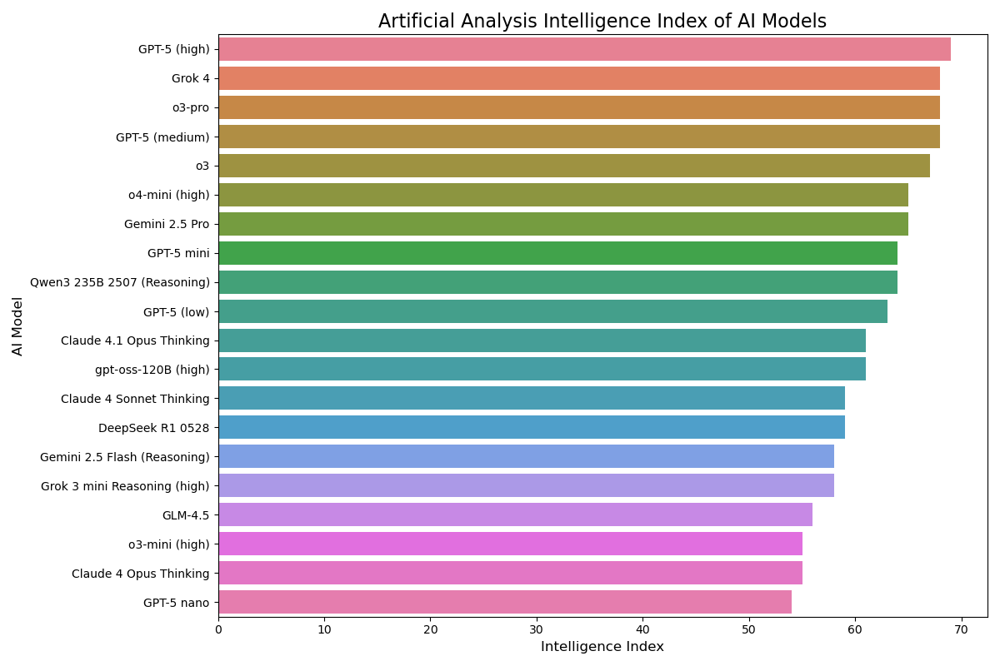
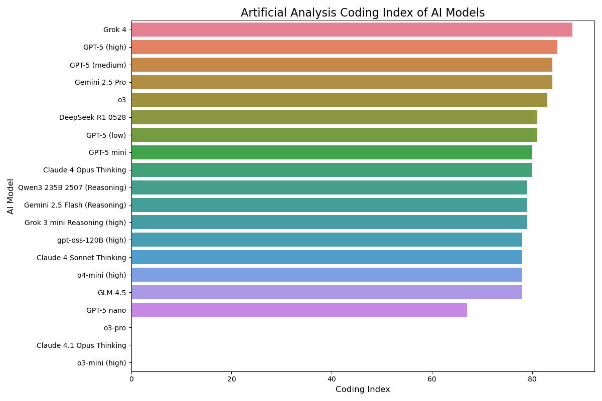
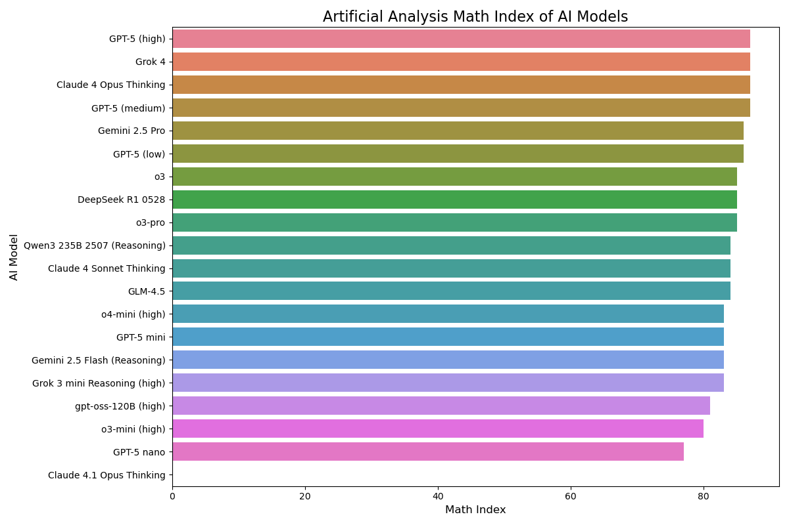
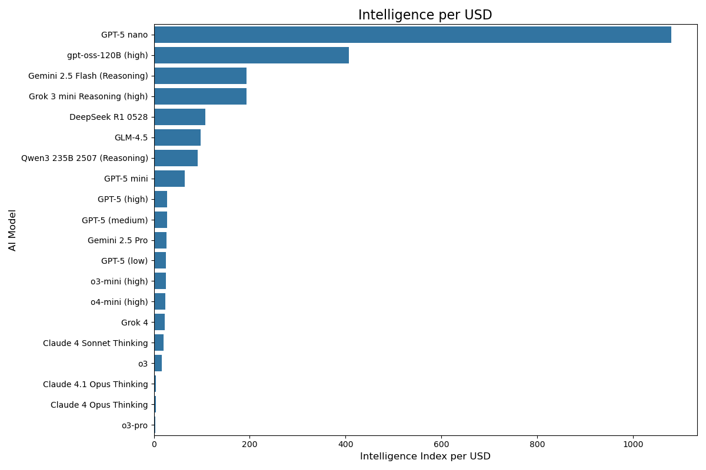
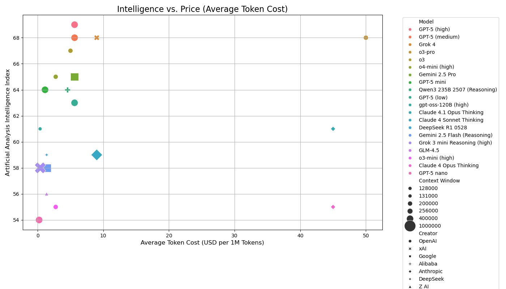
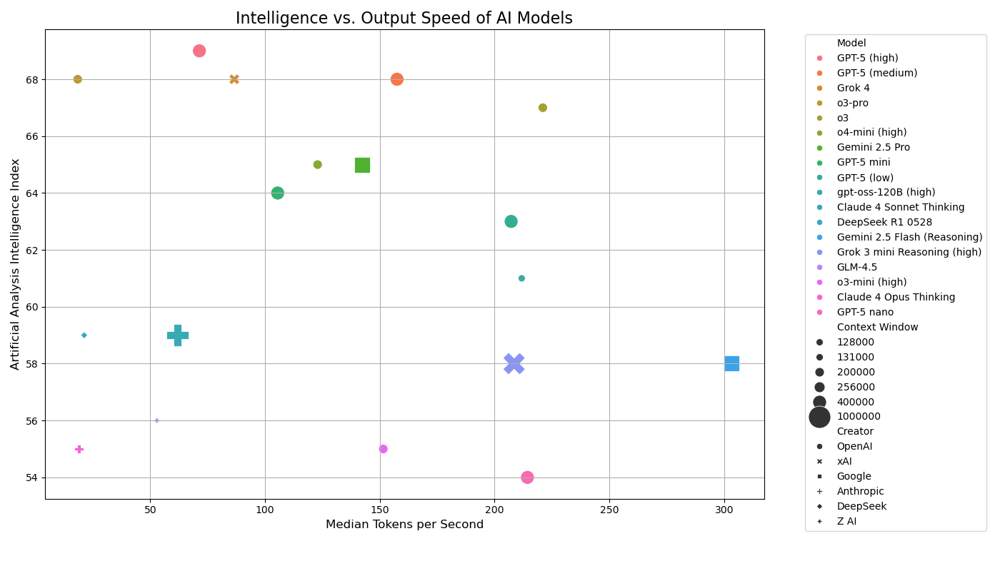
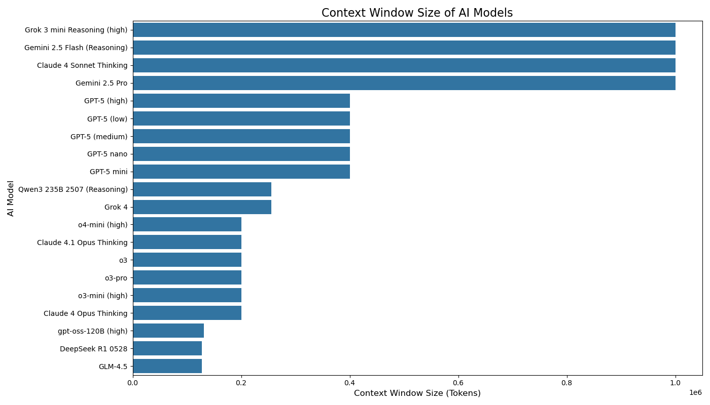

# AI Model Intelligence Index Analysis

A data-driven benchmarking analysis of leading Artificial Intelligence models using standardized metrics from **ArtificialAnalysis.ai**. This project evaluates and compares modern AI models across intelligence, coding ability, mathematical reasoning, cost efficiency, output speed, and context window capacity.

---

## Project Overview

As artificial intelligence models rapidly evolve and become embedded across industries such as healthcare, education, finance, and software development, understanding their strengths, limitations, and trade-offs is increasingly important.

This repository presents a **comparative analysis of state-of-the-art AI models** using publicly available leaderboard data from **ArtificialAnalysis.ai**, supported by visualizations and detailed interpretation.

The analysis addresses key questions such as:
- Which AI models demonstrate the highest overall intelligence?
- How do coding and mathematical abilities vary across models?
- What trade-offs exist between intelligence, price, and output speed?
- Which models offer the best value for money?
- How does context window size differ across providers?

---

## Objectives

- Compare leading AI models using standardized intelligence benchmarks  
- Evaluate **Artificial Intelligence Index**, **Coding Index**, and **Math Index**  
- Analyze relationships between:
  - Intelligence vs. Price  
  - Intelligence vs. Output Speed  
- Examine **Intelligence per USD** (cost efficiency)  
- Compare **Context Window Sizes**  
- Provide visual, data-driven insights to support informed model selection  

---

## 🧰 Tools & Technologies

- **Python**
- **Jupyter Notebook**
- **Pandas** – Data handling and preprocessing  
- **NumPy** – Numerical computation  
- **Matplotlib** – Core plotting  
- **Seaborn** – Statistical visualization  

---

## Project Structure

- **dataset/**: Contains the raw data used for analysis.
  - [`modelData.csv`](dataset/modelData.csv): A CSV file containing metrics for models like GPT-5, Claude 4, Gemini 2.5, and others.
- **model/**: Contains the analysis logic.
  - [`AAII_Analysis.ipynb`](model/AAII_Analysis.ipynb): A Jupyter Notebook for processing the data and generating insights.
- **visualization/**: Directory designated for storing generated charts and graphs.

## Dataset Overview

The data located in [`dataset/modelData.csv`](dataset/modelData.csv) includes the following metrics for each model:

- **Model Identity**: Name and Creator (e.g., OpenAI, Google, xAI).
- **Capabilities**:
  - Context Window size.
  - Artificial Analysis Intelligence Index (Overall score).
  - Coding Index and Math Index.
- **Economics**: Input and Output cost (USD per 1M tokens).
- **Performance**: Median tokens per second.
- **Value Metrics**: Intelligence per USD and Speed per USD.

## Getting Started

1. Ensure you have a Python environment set up with Jupyter support and data analysis libraries (e.g., `pandas`, `matplotlib`).
2. Open [`model/AAII_Analysis.ipynb`](model/AAII_Analysis.ipynb) to view or run the analysis.
3. The notebook is configured to read data
--- 

## 📊 Visual Analysis & Results

All charts shown below are generated from the analysis notebook and stored in the `visualization/` directory.

---

### 🔹 Artificial Intelligence Index

This chart compares the overall reasoning and problem-solving capability of leading AI models.

**Key Insight:**  
Flagship models such as **GPT-5 (High & Medium)** and **Grok 4** lead in overall intelligence, while smaller and optimized variants trade reasoning depth for efficiency.

---

### 🔹 Coding Index

This visualization ranks AI models based on their performance in coding and technical problem-solving tasks.

**Key Insight:**  
**Grok 4** achieves the highest coding score, followed closely by **GPT-5 (High & Medium)** and **Gemini 2.5 Pro**, indicating superior performance on complex programming tasks.

---

### 🔹 Math Index

This chart evaluates each model’s mathematical reasoning and analytical problem-solving capability.

**Key Insight:**  
Larger, high-capacity models dominate advanced mathematical reasoning, while smaller models show moderate performance due to optimization for speed and cost.

---

### 🔹 Intelligence per USD (Value for Money)

This visualization highlights how much intelligence each model delivers per dollar spent.

**Key Insight:**  
**GPT-5 nano** provides the highest intelligence per USD, making it the most cost-effective option despite having lower absolute intelligence scores.

---

### 🔹 Intelligence vs. Price per Token

This scatter plot compares intelligence scores against average token costs.

**Key Insight:**  
Higher pricing does not necessarily correspond to higher intelligence. Several premium models are significantly more expensive without proportional performance gains.

---

### 🔹 Intelligence vs. Output Speed

This visualization examines the relationship between reasoning capability and response generation speed.

**Key Insight:**  
Mid-range intelligence models often achieve higher output speeds, while top-tier intelligence models balance performance with moderate response rates.

---

### 🔹 Context Window Size

This bar chart compares the maximum context window size supported by each AI model.

**Key Insight:**  
Models such as **Grok 3 mini**, **Gemini 2.5 Flash**, and **Claude 4 Sonnet Thinking** support very large context windows (>1M tokens), making them suitable for long-document and multi-turn reasoning tasks.

---

---

## Detailed Documentation

A comprehensive explanation of the methodology, analysis process, results, and interpretations is available in:

**Artificial Intelligence Analysis Report.pdf**

---

## Author

**Apekshya Sharma**

---

## License

This project is intended for **academic and research purposes**.  
All data used in this analysis is sourced from publicly available information on **ArtificialAnalysis.ai**.

